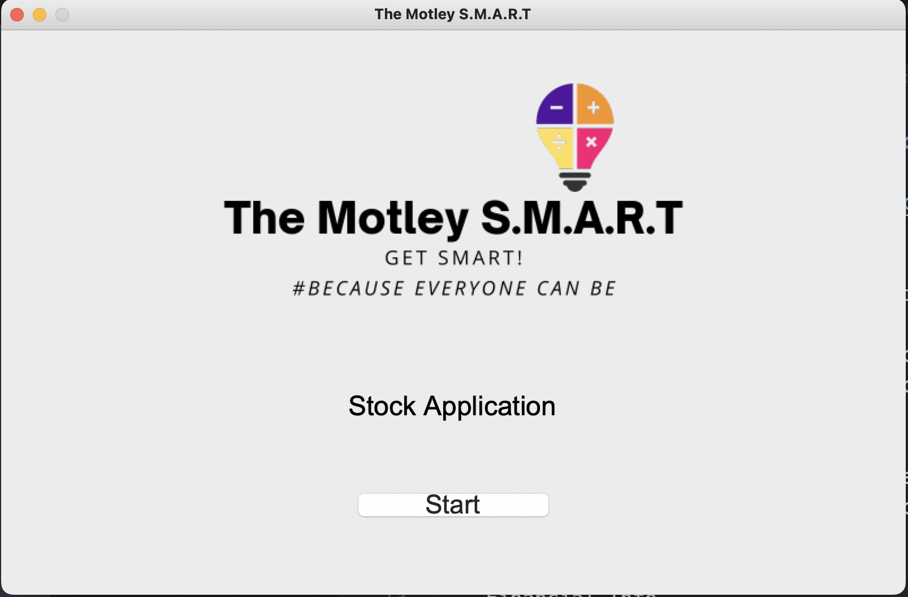
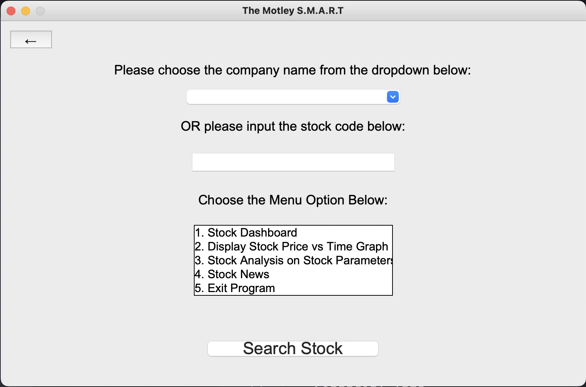
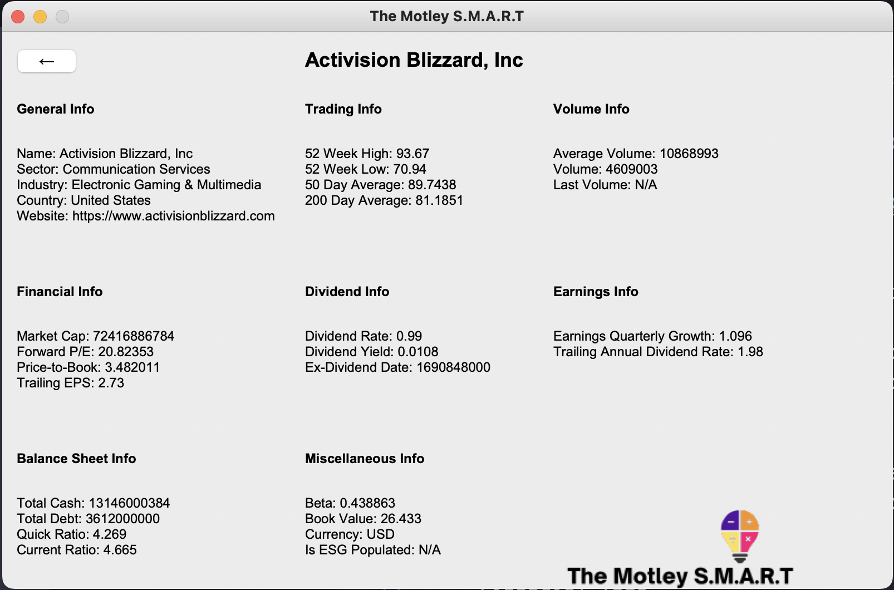
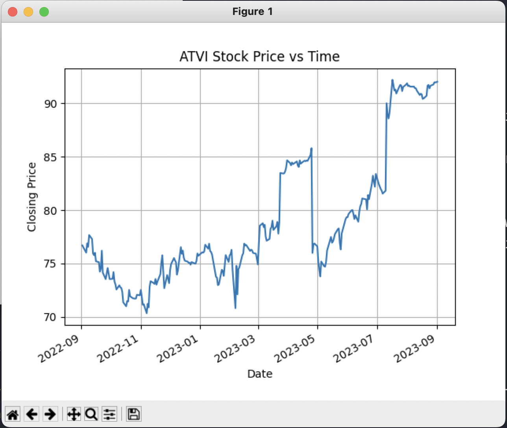

# The Motley S.M.A.R.T Stock Application


## Quick Links
- [Documentation](https://github.com/dymasius12/TheMotleySMART/blob/Main/Motley_SMART_Documentation.md) Full Documentation Page!

## Description
The Motley S.M.A.R.T is a desktop application that provides insights and visualization for stocks, specifically the S&P 500 companies. With an intuitive interface, users can either select a company from a dropdown list or input a stock code directly to view comprehensive stock details or visualize stock price trends.

## Features
- **Company Selection**: Choose a company from the S&P 500 list via a dropdown.
- **Stock Dashboard**: Get a detailed dashboard view of the selected stock, including:
  - General Info
  - Trading Info
  - Financial Info
  - Volume Info
  - Earnings Info
  - And more!
- **Stock Price vs. Time Graph**: Visualize the stock's closing prices over time.
- **(Upcoming Features)**:
  - Stock Analysis on Stock Parameters
  - Stock News






## Installation

1. Ensure you have Python (>= 3.7) installed on your system.
2. Clone this repository:
   ```
   git clone <repository-url>
   ```
3. Navigate to the cloned repository's directory.
4. Install the required libraries:
   ```
   pip install -r requirements.txt
   ```
5. Run the application:
   ```
   python Start_Gui.py or ./Start_Gui.py
   ```

## Usage

1. Start the application.
2. On the landing page, click "Start".
3. From the main menu, select a company from the S&P 500 dropdown or enter a stock code.
4. Choose from the available menu options to view stock data or graphs.

## License

This project is licensed under the MIT License.

## Acknowledgements

- [yfinance](https://pypi.org/project/yfinance/) for fetching stock data.
- [tkinter](https://docs.python.org/3/library/tkinter.html) for GUI development.
- [S&P500] (https://en.wikipedia.org/wiki/List_of_S%26P_500_companies) for S&P500 data.
